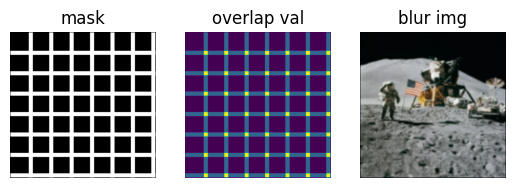

# Image Debluring and Poission Stitching

> Author: Zhen Tong

The deblur process in the mobile device, can have some problem when the image is large and high-resolution. Therefore taking the direct deblur algorithm can be a problem due to the limited memory. Therefore in this project, we use the patch2patch deblur and Poission Stitching. Our contribution includes:

- Robust Patching 
- Use the Least-Square Methods to estimate the deblur image in the frequency domain
- Blending the margin of the patches by solving the Poission Function

## Step 1 Divid Image to Overlaping Patches.

Given an image, we can divide the image into patches in 
$$
(h_{patch}+h_{margin})\times (w_{patch}+w_{margin})
$$
We need to ensure that the patches overlap for latter Poission Blending use.

### Output


## Step 2 Constrained Least Squares Filtering

We assume that the noise is in the gaussian distribution
$$
b = h*x+n
$$
With the gaussian kernel $h$ of size $17\times 17$, and $\sigma = 3$, and for the noise $n$, we sample random noise from $\sigma_r =0.01, \sigma_g=0.03, \sigma_b=0.01$. We apply the noise to the image patch, and we got:


Assume that we know the Gaussian kernel $h$, we can estimate the original iamge with the blur image $b$. The $\lambda ||\nabla x^2||$ term in the objective function is a penalty to generate a smoother solution. However, the parameter $\lambda$ need to be determined manually. 
$$
\min_{x}||h*x-b||^2+\lambda||\nabla^2 x||^2
$$
In the image processing domain, we can comput the lapulaiton of the iamge field with laplation kernel in discrete space, $l$ is the laplacian kernel.
$$
\nabla^2x = l*x
$$
Solve the optimization in the frequency domain can be computationally faster.
$$
B = H\cdot X+N\\
\min_X ||HX-B||^2+\lambda||LX||^2
$$
Because the loss function is a convex function, we can find the optimal solution by applying the first-order derivative equals to zero.
$$
(||H||^2+\lambda ||L||^2)X -H^*B = 0\\
X = \frac{H^*\cdot B}{||H||^2+\lambda||L||^2}
$$
All the multiplication above in the frequency domain is element-wise multiply.

### Experiments

The frequency domain visulization for the flag patch is blow 


With the gaussian filter as a low pass filter, and adding the noise in the spacial domain, the blured image in the frequency domain is as below.


With $\lambda$ of different value, the outputs are:


From the figure above, we know that when the $\lambda=0.01$ performs well. Too small $\lambda$ cause the frequency domian in grid pattern, while too large $\lambda$​ will lose the high frequency detail.


## Step 3 Poission Blending the Patches.

After we deblur the image patch by patch, we can stitch them back together by Poission Blending. First, we compute the mask and the overlaping times of the patches:



By finding all the position $X$ in the mask that need to be fill(the black area in mask). In the [paper](https://dl.acm.org/doi/pdf/10.1145/882262.882269), we know that we need a destination image $g$, which is like a gound truth that the target margin $f*$ generate according to. Here, we want to make the overlaping area smoothly attached between the patches. Therefore, the guiding image $f$ at the margin is:
$$
f_{i, j}(X) = \sum _{x^p\in X}x_{ij}^p
$$
The $x$ here is the deblur image patch, and $x\in X$, where $X$ is the patch set that overlap at position $(i, j)$. $N_{i, j}$ is the overlapping times of the patches according to the "overlap val" above.

With the destination image at the mask, we can comput the partial derivative of the destination image and let the laplacian of the $f^*$ equals the divergence of the destination $f$​. The main idea here is that we want to keep the gradient pattern as same as before (*formula (9)*) while seamlessly generate a margin between patches (*formula(10)*).
$$
\nabla^2f^* = \nabla^2 f
$$

$$
f^*|_{\part\Omega}=g|_{\part\Omega}
$$

Then, we can compute the pixel value in the $f^*$ but solving the two equations above

```python
loc = np.nonzero(mask)
num = loc[0].shape[0] 
A = lil_matrix((num, num), dtype=np.float64)
b = np.ndarray((num, ), dtype=np.float64) 
hhash = {(x, y): i for i, (x, y) in enumerate(zip(loc[0], loc[1]))}
dx = [1,0,-1,0]
dy = [0,1,0,-1]
for i, (x, y) in enumerate(zip(loc[0],loc[1])):
    A[i, i] = -4
    b[i] = lap[x, y]
    p = [(x + dx[j], y + dy[j]) for j in range(4)] 
    for j in range(4):
        if p[j] in hhash: 
            A[i, hhash[p[j]]] = 1
        else:
            b[i] -= dst[p[j]]
            
A = A.tocsc()
X = linalg.splu(A).solve(b)
result = np.copy(dst)
for i, (x, y) in enumerate(zip(loc[0],loc[1])):
    if X[i] < 0:
        X[i] = 0
    if X[i] > 255:
        X[i] = 255
    result[x, y] = X[i]
```

## Results

First, we can use the patch2patch deblur and sum all the patches up to the output image, (patch size = 100, margin size = 10):


Then we can set the overlaping lighter area in the mask as the source image, and the inside-patch area as the destination lookup. After solving the sparse linear equation $Ax = b$, we insert the variable $x\in f^*$ to the mask $\part\Omega$​, and get:


## How to Run

- Using the python3, go to the `src` directory

  ```bash
  python main.py --img-path  --m-size <margin size> --p-size <patch size> --lbd <The lambda for the laplacian panalty> --
  ```

  Or run as default

  ```bash
  python main.py
  ```

- Using the Jupyter notebook, run `notebook.ipynb`, see the [running log](log.pdf)

## More Running Show Case

```bash
--m-size 2 --p-size 10 --lbd 0.01
```

Blur Image:


Image after patch deblur


Image after poission blending


## References

- Poisson Image Editing Microsoft Research UK https://dl.acm.org/doi/pdf/10.1145/882262.882269
- Useful blog for Poission blending https://www.cnblogs.com/3-louise-wang/p/16671316.html
